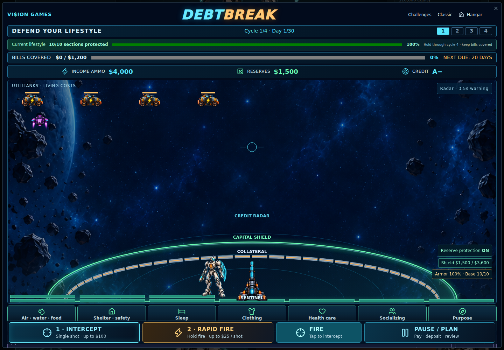
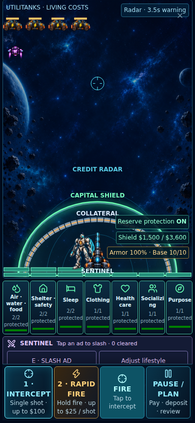

# Debtbreak: lifestyle protection mission

The objective is to finish four payment cycles with every required lifestyle section functioning and all issued payment requirements covered. The player can finish construction at any point, then defend it. Outstanding loan principal beyond required payments is not a loss condition. Four cycles without enough protection is a completed attempt, not a successful mission.

Essential, Current, and Expanded scenarios require 7, 10, and 14 wall sections across the same seven lifestyle needs. Walls cost $150 and add 25 condition. Extra walls are retained after downsizing; they are never sold or refunded. A zero-condition required wall needs repair. Building sets aside enough cash for issued bills but does not require the reserve goal.

The reserve goal now charges a capital shield: 25% less arcade breach damage while available reserves meet a positive goal. It creates no money and changes no payment requirement. Ordinary automatic reserve payment protection remains separately switchable.

Tap or click an advertisement, press E, or use Slash Ad to send Sentinel to its side of the battlefield. He runs to intercept, swings when the ad enters range, then recovers. Pausing freezes the command. Ads rejected this way award neither cash nor credit; they cost no ammunition. Accessible free Pass remains in the paused planner.

Lifestyle changes are queued in Pause / Plan, take effect at the next cycle, and are locked during cycle four. The starting budget is immutable. The prototype defaults to a disclosed 20% adjustable living-cost allowance; players may set it from zero to 50% of starting living costs. Essential subtracts that allowance from baseline, Current restores baseline, and Expanded adds it. Distribution across captured living-cost rows uses exact integer cents. Existing debt requirements and issued bills never change retroactively. This allowance is a scenario assumption, not verified savings.

Asset sales / Sell Bomb, real budget imports, credit recovery actions, and recovery-plan advice are deferred. Unequal or unachievable financial scenarios remain an accepted prototype limitation.

Verification lives in the existing Node test suite and `tests/browser/`. Calculator and captured budget inputs are unchanged. Browser fixtures verify gameplay independently from calculator scoring.

## Validation · 2026-09-28

The following records the original Site v50 validation. Current public-repository results are recorded in `../release-manifest.json`.

- Production build succeeded.
- 218 Node tests passed, including the existing private-calculator suite.
- All 24 desktop/mouse and mobile/touch browser scenarios verified. The first full run passed 23; one mobile sword test's Canvas observer excluded an edge-positioned ad. After correcting the observer margin, both desktop and mobile sword cases passed. No game behavior was changed for this test correction.
- Full four-cycle success, incomplete attempts, replay, input release, cash reconciliation, deferred tier changes, and both mobile orientations were exercised with WebGL disabled.
- Screenshots below use synthetic test data. They are functional UI checks, not device performance measurements.

