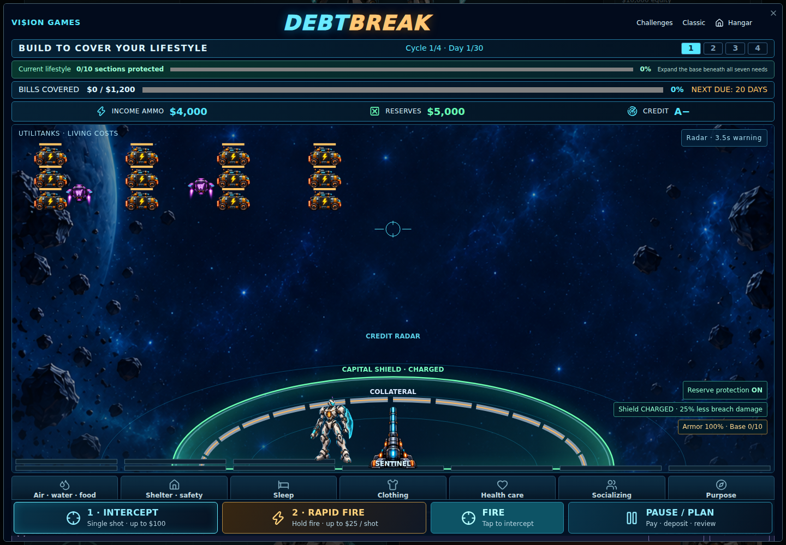
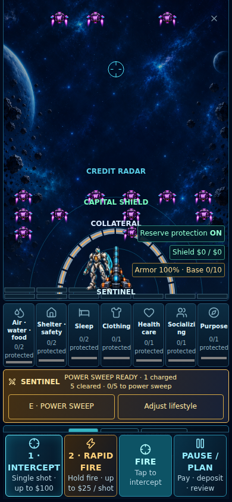

# Debtbreak wave tuning

Requested after version 50 playtesting.

| Element | Updated behavior |
| --- | --- |
| Utilitanks | Standard living-cost waves start as twelve bodies in three rows. Travel time is halved. Bodies share the original obligation; they do not create extra dollars of bills. |
| Debtonators | Flight time is one fifth of the prior duration. Entry direction and credit warning remain deterministic. |
| Want-bots | Two per normal wave and six per rush wave, up from one and three. Maximum active count increases from eight to sixteen. Fall time is halved. |
| Sword | One connected normal strike rejects its selected ad outright. Repeated taps on the same target do not restart it. A different tap while busy queues the next target. |
| Power sweep | Every five sword-cleared ads award one charged strike. The next strike also rejects ads within 320 game units of the target. A gold sweep and a visible five-clear counter show the bonus. Charges reset on replay. |

Faster enemies contact defenses sooner. Reserve protection can pay the issued claim at contact; otherwise the hit damages arcade armor. Contact resolves once per underlying obligation, rather than once per visible body. Due dates, scheduled interest, fee dates, and four-cycle duration remain unchanged. Early arcade contact cannot by itself post a fee or mark a payment late. Early payments may reduce later modeled interest normally.

Want-bots use separate lane slots to make individual targets readable. The Sentinel moves faster and can queue one upcoming target; pause freezes travel, the swing, recovery, and the queue. Neither normal nor powered sword attacks spend money or grant money or credit points. Passing an ad in the planner does not charge the sword.

Very small obligations remain limited by integer cents: fewer than twelve cents cannot be split into twelve positive-value bodies. Paying a wave down naturally reduces the remaining visible ranks.

The calculator, captured hangar data, lifestyle rules, and saved version 50 are preserved. This update intentionally raises combat difficulty; no compensating income or artificial win progress is added.

## Validation · 2026-09-28

The following records the original Site v51 validation. Current public-repository results are recorded in `../release-manifest.json`.

- 224 Node tests passed. Six focused pressure/sword tests also passed after the final feedback-text correction.
- All 28 browser scenarios verified across mouse and mobile touch. The full run passed 26 and identified two power-sweep feedback failures: a newly earned charge hid the sweep's hit count. After correcting that readout, all six affected sword/formation cases passed on both input types.
- Production build succeeded. Existing private calculator files are unchanged.
- Browser tests use synthetic financial inputs and a deterministic frame clock with WebGL disabled; these are functional checks, not device FPS benchmarks.

